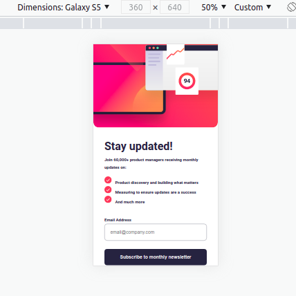
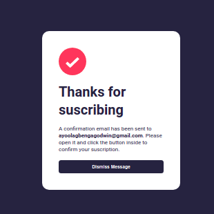
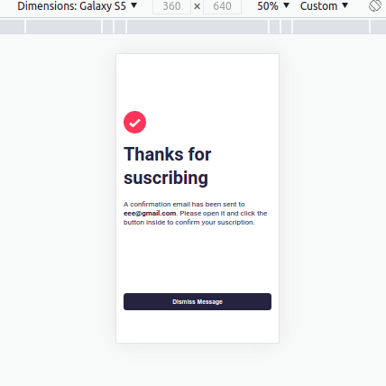
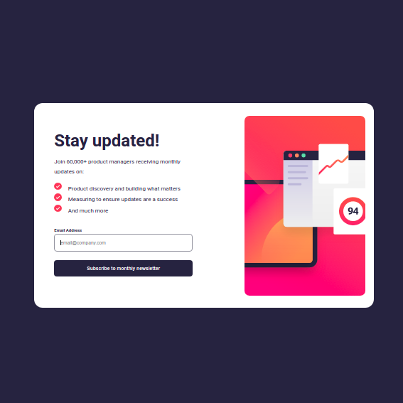

This is a solution to the [Newsletter sign-up form with success message challenge on Frontend Mentor](https://www.frontendmentor.io/challenges/newsletter-signup-form-with-success-message-3FC1AZbNrv). Frontend Mentor challenges is helping me improve my coding skills by building realistic projects.

## Table of Contents

- [Overview](#overview)
  - [The Challenge](#the-challenge)
  - [Screenshot](#screenshot)
  - [Links](#links)
- [My Process](#my-process)
  - [Built With](#built-with)
  - [What I Learned](#what-i-learned)
  - [Continued Development](#continued-development)
- [Author](#author)

## Overview

### The Challenge

Users should be able to:

- Add their email and submit the form
- See a success message with their email after successfully submitting the form
- See form validation messages if:
  - The field is left empty
  - The email address is not formatted correctly
- View the optimal layout for the interface depending on their device's screen size
- See hover and focus states for all interactive elements on the page

### Screenshot

### Links

- [Solution URL](https://github.com/gayoola/newsletter-signup-form/tree/master)
- [Live Site URL](https://gayoola.github.io/newsletter-signup-form/)

## My Process

### Built With

- Semantic HTML5 markup
- CSS custom properties
- SCSS (Sass) for enhanced styling
- Flexbox
- CSS Grid
- Mobile-first workflow
- JavaScript
- Any other tools or libraries used

### What I Learned

- **Responsive Design:** Implemented a mobile-first approach to ensure the form looks good on various screen sizes. Utilized CSS Flexbox and Grid for responsive layouts.

- **Form Validation:** Implemented client-side form validation to ensure that users receive proper feedback when submitting the form. Checked for empty fields and valid email format.

- **SCSS (Sass) Styling:** Utilized SCSS (Sass) for enhanced styling, taking advantage of features like variables, nesting, and mixins. This improved the maintainability and readability of the stylesheet.

- **JavaScript Interactivity:** Used JavaScript to handle form submission and display a success message with the user's email upon successful form submission. This provided a seamless user experience.

- **Accessibility Considerations:** Ensured that the form is accessible by incorporating semantic HTML5 markup and ARIA roles. This improves usability for users with disabilities.

- **Git Version Control:** Leveraged Git for version control, creating branches for features and maintaining a clean commit history. Practiced good version control habits, including branch management and creating meaningful commit messages.

- **Documentation:** Created a clear and informative README.md file to guide users, share project details, and provide instructions for running or deploying the project.

- **Time Management:** Practiced effective time management by breaking down tasks and prioritizing accordingly. This ensured a smooth and timely completion of the project.

### Continued Development

- **Form Accessibility:** Explore and implement additional accessibility features to enhance the form's usability for users with disabilities. Consider ARIA roles, labels, and other accessibility best practices.

- **Enhanced User Feedback:** Experiment with more advanced user feedback techniques, such as animations or transitions, to provide a more engaging and intuitive experience during form interactions.

- **Responsive Images:** Improve the handling of images for different screen sizes. Explore responsive image techniques, such as using the `srcset` attribute or responsive image frameworks, to optimize image loading performance.

- **CSS Preprocessors:** Get familiarized with CSS preprocessors like Sass or Less to streamline your styling workflow. Learn about variables, mixins, and other advanced features offered by preprocessors.

- **Cross-Browser Compatibility:** Test the project on various browsers to ensure cross-browser compatibility. Address any styling or functionality issues that may arise on different browsers.

- **Version Control Collaboration:** Continue to enhance your collaboration skills with Git. Explore advanced Git workflows, such as feature branching, pull requests, and code reviews.

## Author

- Gbenga Ayoola
- [Your Website](https://gayoola.github.io/newsletter-signup-form/)
- Frontend Mentor - [@gayoola](https://www.frontendmentor.io/profile/gayoola)
- Twitter - [@haryorhorlar01](https://twitter.com/haryorhorlar01)

